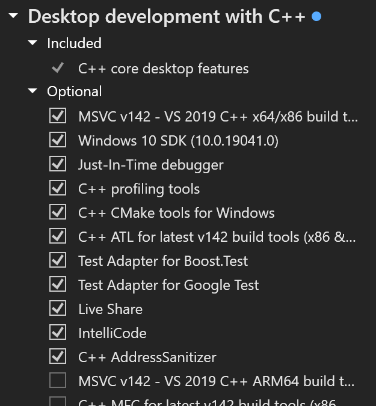

# Part 1 : Prereqs

Install conda from here if not already installed.

https://docs.conda.io/en/latest/miniconda.html

During install, choose the option to only install for you, "This is very important due to changes they have made in the installer and how it handles where conda installs site packages"

If you do not have it already, download and install Visual Studio 2019 community edition, during install select the C++ build utilities, indicated by the following screenshot.



https://my.visualstudio.com/Downloads?q=visual%20studio%202019&wt.mc_id=o~msft~vscom~older-downloads

##### This is crucial.

Once that's all done, reboot.

# Part 2 : Text Interface Setup

You are gonna wanna hit the ole start menu and type "anaconda" in the search bar. 

You want the non-powershell one that pops up.

Once in the conda terminal, you run the following commands one at a time after using CD to move to where you want the text interface installed.

```
conda create -n textgen
conda activate textgen
conda install torchvision=0.14.1 torchaudio=0.13.1 pytorch-cuda=11.7 git -c pytorch -c nvidia
git clone https://github.com/oobabooga/text-generation-webui
cd text-generation-webui
pip install -r requirements.txt
```

Next you are going to download the 8bit support files.

Download these two files.

https://github.com/DeXtmL/bitsandbytes-win-prebuilt/raw/main/libbitsandbytes_cpu.dll

https://github.com/DeXtmL/bitsandbytes-win-prebuilt/raw/main/libbitsandbytes_cuda116.dll

Move those files into 

C:\Users\xxx\miniconda3\envs\textgen\lib\site-packages\bitsandbytes\

Now edit bitsandbytes\cuda_setup\main.py with these changes:

Change this line:

```ct.cdll.LoadLibrary(binary_path)```
 
To the following:
 
```ct.cdll.LoadLibrary(str(binary_path))```

There are two occurrences in the file.

Then replace this line:
 
```if not torch.cuda.is_available(): return 'libsbitsandbytes_cpu.so', None, None, None, None```

With the following:

```if torch.cuda.is_available(): return 'libbitsandbytes_cuda116.dll', None, None, None, None```

# Part 3: 4-bit Mode Support Setup

From within the text-generation-webui folder and while still inside the conda terminal, run the following one at a time.

```
mkdir repositories
cd repositories
git clone https://github.com/qwopqwop200/GPTQ-for-LLaMa
cd GPTQ-for-LLaMa
```

Leave the prompt open but open explorer to the GPTQ-for-LLaMa folder you just created.

You are going to take the four files from the replace folder above and put them in the GPTQ-for-LLaMa folder, overwrite the existing files.

Head back to the conda terminal and run the following.

```
python setup_cuda.py install
```

It should spit out all kinds of crap but as long as there is no fatal errors you should be good.

Next you need to run.

```
pip install -r requirements.txt
```

# Part 4: Model Downloads / Interface Launch

You can grab the actual models here.

https://huggingface.co/decapoda-research/llama-smallint-pt/tree/main

You place them in the root of the models folder, not in the folder created by the tokenizer download below.

To download a tokenizer already 4bit pruned you can run this command from the main folder, "text-generation-webui"

```
python download-model.py --text-only decapoda-research/llama-7b-hf
```

You can change the command to download whichever of the pruned models you want by adjusting the number before the "b", Example llama-13b-hf, llama-30b-hf.

Once it's done, you launch the server with the following command, "also from the root webui folder."

```
python server.py --gptq-bits 4 --no-stream
```

If you get errors, you can remove --no-stream
